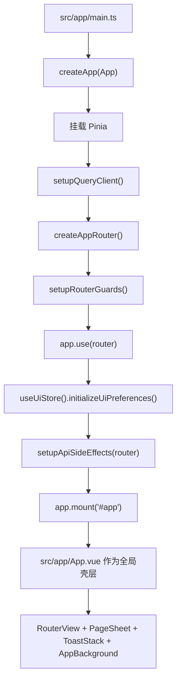

# `now` 项目源码说明文档

## 目录
- [1. 项目概览](#1-项目概览)
- [2. 应用启动链路](#2-应用启动链路)
- [3. 分层设计说明](#3-分层设计说明)
- [4. 业务链路说明](#4-业务链路说明)
- [5. 阅读与维护建议](#5-阅读与维护建议)
- [6. 文件级附录](#6-文件级附录)

## 1. 项目概览

### 1.1 项目定位
`now` 是一个基于 `Vue 3 + Vite + TypeScript` 的内容平台前端项目。它围绕“浏览内容、登录认证、文章创作、送审审核、个人主页管理”几条主业务展开，整体目录设计明显参考了 FSD（Feature-Sliced Design）的分层思想：

- `app` 负责应用装配、启动、全局 Provider、路由和全局壳层。
- `pages` 负责页面级入口，把多个 widget / feature / entity 组合成可访问路由。
- `widgets` 负责大块界面单元，通常承接页面中的完整区域。
- `features` 负责可复用的业务动作，如登录、编辑、送审、审核、资料编辑。
- `entities` 负责领域对象的模型与最小展示单元，如文章、分类、审核记录、用户。
- `shared` 负责基础设施、通用组件、API 封装、常量、工具函数和资源。
- `stores` 负责 Pinia 状态容器，承接跨页面状态与会话信息。

这个分层的核心目标是把“页面编排”“业务动作”“领域模型”“基础设施”拆开，避免所有逻辑都堆在页面组件里。

### 1.2 技术栈

| 类别 | 选型 | 作用 |
| --- | --- | --- |
| UI 框架 | `vue` | 组件化渲染、响应式状态、组合式 API。 |
| 构建工具 | `vite` | 本地开发服务器、打包构建、别名解析。 |
| 语言 | `typescript` | 静态类型、接口契约、模型约束。 |
| 路由 | `vue-router` | 页面路由、权限控制、sheet 路由呈现。 |
| 状态管理 | `pinia` | 鉴权、UI、编辑器、资料、审核等跨组件状态。 |
| 服务端状态 | `@tanstack/vue-query` | 查询缓存、重新获取、加载态与错误态管理。 |
| HTTP | `axios` | 请求实例、鉴权头注入、错误转换。 |
| 编辑器 | `@tiptap/vue-3` 等 | 富文本/Markdown 编辑、图片节点、占位和格式化。 |
| 样式 | `tailwindcss@4` + CSS 变量 | 原子类布局与主题变量结合。 |
| 图标 | `lucide-vue-next` | 图标系统。 |
| 工具库 | `@vueuse/core`、`lodash-es`、`dayjs`、`dompurify`、`markdown-it`、`highlight.js` | 点击外部、工具函数、日期、富文本渲染和高亮。 |

### 1.3 目录分层与依赖方向

| 层级 | 主要职责 | 典型内容 | 不应承载的内容 |
| --- | --- | --- | --- |
| `app` | 应用装配与全局壳层 | `main.ts`、路由、Provider、全局样式 | 具体业务表单和领域映射 |
| `pages` | 路由页面 | 页面布局、查询组合、模块拼装 | 通用基础组件 |
| `widgets` | 页面级区域组件 | 头部、文章阅读器、目录、个人资料头等 | 跨页面全局初始化 |
| `features` | 业务动作单元 | 登录表单、审核动作、编辑器、资料编辑 | 通用 HTTP 基建 |
| `entities` | 领域模型与小型展示单元 | `article.mapper.ts`、`ArticleCard.vue` | 页面流程控制 |
| `shared` | 基础设施和复用资源 | API 封装、基础 UI、常量、工具函数 | 页面特定业务规则 |
| `stores` | 全局状态容器 | `auth`、`ui`、`editor`、`review` | 直接渲染视图 |
| `src/types` | 预留类型目录 | 当前为空，可留作未来全局类型收口 | 实际业务逻辑 |

依赖关系应尽量保持为：

`pages -> widgets/features/entities/shared`

`widgets -> features/entities/shared`

`features -> entities/shared/stores`

`entities -> shared`

`shared` 为最底层，不反向依赖业务层。

### 1.4 命名与组织约定

- 路径别名统一通过 `@/* -> src/*`，减少深层相对路径引用。
- 大多数目录都使用 `index.ts` 作为 barrel 导出入口，降低上层依赖对内部文件结构的耦合。
- `model` 目录通常放纯逻辑、映射、类型、校验、DTO/VM 转换。
- `ui` 目录通常放视图组件。
- `shared/api/modules/*` 负责接口分组，`shared/api/queries.ts` 负责 Vue Query Hook 封装。
- `entities/*/model/*mapper.ts` 负责把服务端 DTO 转成前端 VM，隔离接口格式差异。

### 1.5 三条主线

| 主线 | 入口 | 作用 |
| --- | --- | --- |
| 路由主线 | `src/app/router/*` | 定义页面入口、权限规则、文档标题、sheet 展现方式。 |
| 状态主线 | `src/stores/*` | 管理认证、会话、UI 偏好、编辑器状态、审核数据等共享状态。 |
| API 主线 | `src/shared/api/*` | 统一请求发送、响应解包、错误转译、DTO 归一化、查询缓存。 |

### 1.6 根目录关键文件

| 文件 | 作用 | 备注 |
| --- | --- | --- |
| `package.json` | 项目依赖与脚本入口，定义 `dev`、`build`、`preview`、`generate:api`。 | 是理解项目运行方式的第一入口。 |
| `vite.config.ts` | Vite 配置，负责 Vue 插件、Tailwind 插件、开发代理和 `@` 别名。 | 本地开发请求会代理到 `http://localhost:8080`。 |
| `tsconfig.json` | TypeScript 编译约束，开启严格模式并声明别名和 `vite/client` 类型。 | 影响全项目类型安全和导入解析。 |
| `index.html` | Vite 应用宿主模板。 | 提供挂载点 `#app`。 |
| `scripts/generate-api-types.mjs` | 通过 OpenAPI 地址生成类型文件到 `src/shared/api/generated/`。 | 用于同步后端契约，减少手写 DTO。 |

## 2. 应用启动链路

### 2.1 启动流程图

### 2.2 启动顺序说明

1. `src/app/main.ts` 创建 Vue 应用实例。
2. 通过 `src/app/providers/pinia.ts` 注册全局 Pinia 容器。
3. 通过 `src/app/providers/query.ts` 挂载 Vue Query，并设置默认缓存和重试策略。
4. 通过 `src/app/router/index.ts` 构建路由对象；内部再调用 `setupRouterGuards` 注册鉴权守卫、抽屉切页守卫和标题更新逻辑。
5. UI store 在挂载前初始化主题偏好，使暗色模式在首屏渲染前生效。
6. `setupApiSideEffects.ts` 把 401/403/404 之类的全局副作用与路由联动起来，例如未登录自动跳到登录页。
7. 应用最终挂载到 `#app`。

### 2.3 `App.vue` 的壳层职责

`src/app/App.vue` 不是单纯的 `RouterView` 容器，它承担了几项关键职责：

- 决定哪些路由按普通页面渲染，哪些路由按 `PageSheet` 抽屉层渲染。
- 在 sheet 打开时保留背景页面，实现“页面上再叠一层阅读/编辑/审核面板”的体验。
- 监听 `uiStore` 的抽屉关闭流程，在抽屉离场动画结束后再真正跳转目标路由。
- 挂载全局背景 `AppBackground` 和全局提示 `ToastStack`。

### 2.4 路由系统的关键机制

- `src/app/router/routes/public.ts` 定义公共页面与公共 sheet 页面。
- `src/app/router/routes/creator.ts` 定义创作者可访问的编辑器入口。
- `src/app/router/routes/admin.ts` 定义审核台与管理员审核入口。
- `src/app/router/guards.ts` 负责三类守卫：
  - 抽屉导航守卫：如果全局抽屉未关闭，先触发关闭动画，再执行跳转。
  - 鉴权守卫：处理 `requiresAuth`、`publicOnly`、`roles`。
  - 标题守卫：依据 `route.meta.title` 拼接浏览器标题。

### 2.5 全局 API 副作用

`src/shared/api/http.ts` 和 `src/shared/api/response.ts` 负责把 HTTP 错误与业务错误标准化，`src/app/providers/setupApiSideEffects.ts` 再把这些错误映射为应用层行为：

- `401`：清理认证状态、记录重定向地址、跳到登录页。
- `403`：写入会话层 forbidden 状态并跳到 `403` 页面。
- `404`：转向 not-found 路由。

这意味着页面本身不需要重复处理最基础的鉴权失败跳转逻辑。

## 3. 分层设计说明

### 3.1 `app` 层

`app` 层是应用启动和全局壳层所在位置，只负责装配，不直接实现具体业务表单。它解决的问题是：

- 项目如何启动。
- 路由如何组织。
- 全局样式和主题如何生效。
- 网络层错误如何升级为应用层跳转和提示。

这一层最重要的两个文件是：

- `src/app/main.ts`：真正的启动入口。
- `src/app/App.vue`：整个应用外壳，负责 base route 与 sheet route 的切换。

### 3.2 `pages` 层

`pages` 层对应用户可直接访问的路由页面。页面文件通常只做四件事：

- 从路由中读取参数。
- 调用查询 Hook 或 store。
- 组合 widget / feature / entity。
- 决定空态、加载态、错误态和页面布局。

页面本身通常不直接写底层请求代码，也不直接持有复杂的领域映射逻辑。

### 3.3 `widgets` 层

`widgets` 是页面里的大块区域组件，通常可以被多个页面复用，例如：

- `AppHeader` 作为全局页头。
- `ArticleReader` 负责整篇文章的阅读区域。
- `ArticleToc` 负责目录导航。
- `ProfileHeader` 与 `ProfileTabs` 负责个人主页上半部分结构。

如果一个组件已经超出“简单 UI 控件”的范围，但还不足以成为整页路由，它往往适合放在 `widgets`。

### 3.4 `features` 层

`features` 承载“用户能做的一件事”，而不是“页面长什么样”。例如：

- 登录。
- 注册。
- 富文本编辑。
- 提交审核。
- 取消审核。
- 审核通过/退回/拒绝。
- 修改个人资料。

feature 会组合共享组件、调用 API、操作 store，并暴露更高层可复用的接口或组件。

### 3.5 `entities` 层

`entities` 解决的是“系统里有什么核心对象，以及这些对象如何被映射和展示”：

- 文章 `article`
- 分类 `category`
- 审核记录 `review`
- 用户 `user`

每个实体通常都有：

- `*.types.ts`：定义 DTO/Entity/VM 类型。
- `*.constants.ts`：状态、标签、映射表、默认值。
- `*.mapper.ts`：把服务端数据转成前端展示模型。
- `ui/*.vue`：最小可复用展示单元。

### 3.6 `shared` 层

`shared` 是整个项目的基础设施中心，内部又可以细分为：

- `api`：请求实例、响应解包、查询 Hook、接口分组。
- `components`：基础 UI 组件和通用布局。
- `constants`：跨层复用的枚举和值。
- `utils`：纯函数工具。
- `config`：环境变量读取。
- `composables`：通用 Composition API 封装。
- `assets`：图片和图标资源。

这层的原则是“通用、稳定、无业务页面上下文依赖”。

### 3.7 `stores` 层

Pinia store 用于承接跨页面共享状态，当前主要分为：

- `auth`：当前登录用户和 token。
- `session`：本次会话级重定向与鉴权码。
- `ui`：主题、搜索词、抽屉状态、转场抑制。
- `editor`：编辑器上下文、保存与提交流程状态。
- `draft`：草稿列表。
- `profile`：个人主页数据。
- `review`：待审核队列和审核日志。

### 3.8 当前的预留目录

代码树里存在一些当前没有文件或尚未完整启用的预留目录，例如：

- `src/types`
- `src/features/article-delete`
- `src/widgets/fullpage-drawer`
- `src/widgets/publish-dropdown`

这些目录说明项目已经预留了进一步拆分能力，但当前交付版本还没有对应实现文件。

## 4. 业务链路说明

### 4.1 首页浏览链路

1. 用户访问首页路由 `/`，进入 `src/pages/home/HomePage.vue`。
2. 页面调用 `useHomeQuery()`，底层走 `shared/api/modules/home.ts`。
3. `shared/api/adapters.ts` 先把后端返回的首页数据标准化。
4. `entities/article/model/article.mapper.ts` 与 `entities/category/model/category.mapper.ts` 再把 DTO 转成适合 UI 的 VM。
5. 页面把主推荐内容交给 `HeroSection`，把分栏文章卡片交给 `ArticleCard`。

这个链路体现了项目的典型分工：页面只调查询和拼视图，真正的接口清洗与展示模型转换分别落在 API 层和 entity 层。

### 4.2 登录鉴权链路

1. 用户访问 `/login`，页面挂在 `AuthPageShell` 之下。
2. `LoginForm.vue` 做表单校验并调用 `features/auth/api/index.ts`。
3. `shared/api/modules/auth.ts` 发起登录请求。
4. `features/auth/model/auth.mapper.ts` 把表单值转成 DTO，并把响应转成会话模型。
5. `stores/auth.ts` 写入 token、用户资料和持久化方式（local/session）。
6. 若路由上带有 `redirect`，登录成功后回到原页面，否则跳首页。

### 4.3 文章阅读链路

1. 用户点击文章卡片后进入 `/articles/:id`，该路由被声明为 `presentation: 'sheet'`。
2. `App.vue` 不直接切整页，而是打开 `PageSheet`。
3. `ArticleReadPage.vue` 内部使用 `ArticleReader` 加载文章详情。
4. `useArticleDetailQuery()` 调用 `articleApi.getArticleDetail()`，再映射成 `ArticleDetailVm`。
5. `ArticleReaderHeader` 展示标题、作者、状态；`ArticleReaderBody` 负责正文富文本显示。
6. `ArticleToc` 根据正文结构同步目录锚点。

### 4.4 文章编辑与草稿保存链路

1. 用户进入 `/article-editor-new` 或 `/editor/:id`。
2. 页面 `ArticleEditorPage.vue` 读取当前文章、编辑状态、冷却时间、提交资格。
3. `ArticleEditorForm.vue` 负责标题、摘要、正文、封面等输入。
4. `features/article-editor/model/*` 负责表单值、Markdown 内容、图片节点、草稿负载映射与校验。
5. `articleApi.createArticle()` / `saveDraft()` 负责创建和保存。
6. `stores/editor.ts` 记录当前文章、dirty 状态、保存中、提交中、上次保存时间。

这里最重要的设计是把“页面交互编排”和“编辑器领域逻辑”拆开：页面处理整体工作流，feature 的 model 处理内容映射和校验。

### 4.5 提交审核与取消审核链路

1. 页面调用 `submitArticleById` 或 `cancelReviewByArticleId`。
2. 底层走 `shared/api/modules/article.ts` 的 `submitArticle` / `cancelReview`。
3. 成功后编辑器页面更新当前文章状态，并刷新审核队列。
4. `stores/review.ts` 和 Vue Query 都会参与刷新，保证审核台和编辑页状态一致。

### 4.6 审核链路

1. 管理员访问 `/review` 查看 `ReviewDashboardPage.vue`。
2. 页面通过 `usePendingReviewsQuery()` 获取待审核文章列表，交给 `ReviewQueueStrip` 展示。
3. 进入 `/review/articles/:id` 后，页面会同时加载文章正文和审核日志。
4. `ReviewActionBar.vue` 提供“通过 / 退回修改 / 拒绝”操作。
5. 对于需要理由的动作，`features/review-action/model/index.ts` 会校验理由长度和必填规则。
6. 动作成功后刷新待审核列表与审核日志，使审核台状态保持同步。

## 5. 阅读与维护建议

### 5.1 建议的阅读顺序

如果你是第一次接手这个项目，推荐按下面顺序看：

1. `package.json`、`vite.config.ts`、`tsconfig.json`
2. `src/app/main.ts`、`src/app/App.vue`
3. `src/app/router/*`
4. `src/shared/api/*`
5. `src/stores/*`
6. `src/pages/home/HomePage.vue`、`src/pages/article/ArticleEditorPage.vue`、`src/pages/article/ArticleReviewPage.vue`
7. 对应的 `widgets`、`features`、`entities`

### 5.2 修改需求时优先定位

| 需求类型 | 优先看哪些文件 |
| --- | --- |
| 调整路由、权限、页面标题 | `src/app/router/index.ts`、`src/app/router/guards.ts`、`src/app/router/routes/*` |
| 修改登录/退出/鉴权行为 | `src/features/auth/*`、`src/stores/auth.ts`、`src/app/providers/setupApiSideEffects.ts` |
| 修改首页数据或推荐区展示 | `src/pages/home/HomePage.vue`、`src/widgets/hero-section/*`、`src/shared/api/modules/home.ts` |
| 修改文章阅读展示 | `src/pages/article/ArticleReadPage.vue`、`src/widgets/article-reader/*`、`src/widgets/article-toc/*` |
| 修改编辑器 | `src/pages/article/ArticleEditorPage.vue`、`src/features/article-editor/*`、`src/stores/editor.ts` |
| 修改审核规则或审核 UI | `src/pages/article/ArticleReviewPage.vue`、`src/features/review-action/*`、`src/entities/review/*` |
| 修改个人主页 | `src/pages/profile/ProfilePage.vue`、`src/widgets/profile-*/*`、`src/features/profile-edit/*` |
| 修改通用按钮、输入框、对话框 | `src/shared/components/base/*` |

## 6. 文件级附录

说明：

- 下表覆盖当前 `src` 中全部文件，并补充根目录关键配置文件。
- “关键依赖/被谁使用”描述的是主要关系，而不是穷举所有引用。
- `index.ts` 多数是 barrel 导出文件，目的是统一对外暴露入口。

### 6.1 根目录关键文件

| 文件路径 | 所属模块 | 核心职责 | 关键依赖/被谁使用 | 备注 |
| --- | --- | --- | --- | --- |
| `package.json` | 根目录 | 定义依赖、脚本、Node 版本约束。 | 被 npm/Vite/开发环境使用。 | 项目运行入口配置。 |
| `vite.config.ts` | 根目录 | 配置 Vue、Tailwind、代理和路径别名。 | 被 Vite 启动和构建流程读取。 | 决定本地联调方式。 |
| `tsconfig.json` | 根目录 | 配置 TypeScript 严格模式、路径别名和包含范围。 | 被 TS、IDE、`vue-tsc` 使用。 | 影响全局类型检查。 |
| `index.html` | 根目录 | 提供挂载容器和 HTML 模板。 | 被 Vite 开发服务器与构建产物使用。 | 包含 `#app`。 |
| `scripts/generate-api-types.mjs` | 脚本 | 读取 OpenAPI 地址并生成 API 类型。 | 被 `npm run generate:api` 调用。 | 类型生成脚本。 |

### 6.2 `src/app`

| 文件路径 | 所属模块 | 核心职责 | 关键依赖/被谁使用 | 备注 |
| --- | --- | --- | --- | --- |
| `src/app/App.vue` | `app` | 全局应用壳层，负责 base route、sheet route、背景与 toast 容器。 | 被 `main.ts` 挂载；依赖 `PageSheet`、`ToastStack`、`AppBackground`、`uiStore`。 | 核心壳层组件。 |
| `src/app/main.ts` | `app` | 创建 Vue 应用，注册 Pinia、Vue Query、Router，并初始化 UI 偏好与 API 副作用。 | 项目启动入口。 | 应用真实入口。 |
| `src/app/providers/pinia.ts` | `app/providers` | 创建并导出全局 Pinia 实例。 | 被 `main.ts`、各 store 间接使用。 | Provider 基础设施。 |
| `src/app/providers/query.ts` | `app/providers` | 创建 QueryClient，配置缓存和重试策略，并安装 Vue Query。 | 被 `main.ts` 使用；依赖 `ApiBusinessError`。 | 服务端状态 Provider。 |
| `src/app/providers/setupApiSideEffects.ts` | `app/providers` | 把 API 401/403/404 副作用与 store、router 绑定。 | 被 `main.ts` 调用；依赖 `authStore`、`sessionStore`。 | 全局错误升级入口。 |
| `src/app/router/guards.ts` | `app/router` | 实现抽屉关闭守卫、登录权限守卫和标题更新逻辑。 | 被 `router/index.ts` 调用。 | 路由行为控制核心。 |
| `src/app/router/index.ts` | `app/router` | 创建路由实例、合并路由表、声明 `RouteMeta`、定义滚动行为。 | 被 `main.ts` 调用。 | 路由主入口。 |
| `src/app/router/routes/admin.ts` | `app/router/routes` | 声明管理员专属页面和审核 sheet 路由。 | 被 `router/index.ts` 合并。 | 管理端路由表。 |
| `src/app/router/routes/creator.ts` | `app/router/routes` | 声明创作者可访问的编辑器路由。 | 被 `router/index.ts` 合并。 | 创作入口路由表。 |
| `src/app/router/routes/public.ts` | `app/router/routes` | 声明首页、认证页、搜索、分类、阅读、个人主页和系统页路由。 | 被 `router/index.ts` 合并。 | 公共路由表。 |
| `src/app/styles/base.css` | `app/styles` | 放置全局基础样式重置与通用基线样式。 | 被 `index.css` 间接引入。 | 样式基础层。 |
| `src/app/styles/index.css` | `app/styles` | 作为全局样式总入口，聚合 base/theme/prose 等样式。 | 被 `main.ts` 直接导入。 | 样式入口文件。 |
| `src/app/styles/prose.css` | `app/styles` | 定义正文富文本排版样式。 | 被阅读器和富文本区域间接使用。 | 文章正文样式。 |
| `src/app/styles/theme.css` | `app/styles` | 定义 CSS 变量、颜色主题、表面层级和暗色模式变量。 | 被全项目组件样式读取。 | 主题变量核心。 |

### 6.3 `src/pages`

| 文件路径 | 所属模块 | 核心职责 | 关键依赖/被谁使用 | 备注 |
| --- | --- | --- | --- | --- |
| `src/pages/article/ArticleEditorPage.vue` | `pages/article` | 承载文章创建、编辑、保存、送审、取消审核全流程。 | 路由 `/article-editor-new`、`/editor/:id`；依赖 `editorStore`、`ArticleEditorForm`。 | 最复杂的页面之一。 |
| `src/pages/article/ArticleReadPage.vue` | `pages/article` | 在 sheet 中展示文章正文与目录，并为管理员提供删除入口。 | 路由 `/articles/:id`；依赖 `ArticleReader`、`ArticleToc`。 | 阅读页。 |
| `src/pages/article/ArticleReviewPage.vue` | `pages/article` | 管理员审核文章页面，组合正文、目录、审核日志与审核操作条。 | 路由 `/review/articles/:id`。 | 审核详情页。 |
| `src/pages/auth/AuthPageShell.vue` | `pages/auth` | 为登录、注册、找回密码、重置密码提供统一外壳和切页动画。 | 作为认证子路由父级组件。 | 认证流程容器。 |
| `src/pages/auth/ForgotPasswordPage.vue` | `pages/auth` | 找回密码页面入口，承载对应表单组件。 | 被公共认证子路由使用。 | 认证子页面。 |
| `src/pages/auth/LoginPage.vue` | `pages/auth` | 登录页面入口。 | 被公共认证子路由使用。 | 认证子页面。 |
| `src/pages/auth/RegisterPage.vue` | `pages/auth` | 注册页面入口。 | 被公共认证子路由使用。 | 认证子页面。 |
| `src/pages/auth/ResetPasswordPage.vue` | `pages/auth` | 重置密码页面入口。 | 被公共认证子路由使用。 | 认证子页面。 |
| `src/pages/category/CategoryPage.vue` | `pages/category` | 根据分类路由参数拉取并展示对应栏目文章列表。 | 路由 `/category/:tab?`。 | 分类聚合页。 |
| `src/pages/home/HomePage.vue` | `pages/home` | 首页入口，组合头部、Hero 区和多分栏文章卡片列表。 | 路由 `/`；依赖 `useHomeQuery`。 | 首页核心页面。 |
| `src/pages/profile/ProfilePage.vue` | `pages/profile` | 个人主页入口，组合资料头、标签页、文章列表与管理员待审区。 | 路由 `/u/:username`。 | 个人主页。 |
| `src/pages/review/ReviewDashboardPage.vue` | `pages/review` | 审核台首页，展示待审核队列和刷新入口。 | 路由 `/review`。 | 管理端列表页。 |
| `src/pages/search/SearchPage.vue` | `pages/search` | 搜索结果页，负责关键词同步、分页与空态展示。 | 路由 `/search`。 | 搜索聚合页。 |
| `src/pages/system/ForbiddenPage.vue` | `pages/system` | 403 页面入口。 | 当权限不足时由路由或 API 副作用跳转。 | 系统页。 |
| `src/pages/system/NotFoundPage.vue` | `pages/system` | 404 页面入口。 | 当资源不存在或路径未匹配时展示。 | 系统页。 |

### 6.4 `src/widgets`

| 文件路径 | 所属模块 | 核心职责 | 关键依赖/被谁使用 | 备注 |
| --- | --- | --- | --- | --- |
| `src/widgets/app-background/AppBackground.vue` | `widgets/app-background` | 渲染全局背景图层，根据主题切换背景资源和氛围层。 | 被 `App.vue` 使用。 | 纯视觉 widget。 |
| `src/widgets/app-background/index.ts` | `widgets/app-background` | 导出背景 widget。 | 被 `App.vue` 导入。 | barrel 导出。 |
| `src/widgets/app-header/AppHeader.vue` | `widgets/app-header` | 全局页头，组合 logo、分类菜单、搜索入口和右侧操作。 | 被首页、搜索页、分类页、资料页、审核台等页面使用。 | 全局导航区。 |
| `src/widgets/app-header/AppHeaderActions.vue` | `widgets/app-header` | 页头右侧动作区，通常包含登录入口、主题切换、草稿等动作。 | 被 `AppHeader.vue` 组合。 | 页头子组件。 |
| `src/widgets/app-header/AppHeaderLogo.vue` | `widgets/app-header` | 展示品牌 logo，并承载返回首页等基础导航行为。 | 被 `AppHeader.vue` 使用。 | 页头子组件。 |
| `src/widgets/app-header/index.ts` | `widgets/app-header` | 统一导出页头相关组件。 | 被页面层导入。 | barrel 导出。 |
| `src/widgets/article-reader/ArticleReader.vue` | `widgets/article-reader` | 拉取文章详情并组合头部和正文区，统一处理加载态和错误态。 | 被阅读页和审核页使用。 | 阅读区域核心。 |
| `src/widgets/article-reader/ArticleReaderBody.vue` | `widgets/article-reader` | 渲染文章正文内容，通常负责富文本/Markdown 的最终展示。 | 被 `ArticleReader.vue` 使用。 | 正文展示组件。 |
| `src/widgets/article-reader/ArticleReaderHeader.vue` | `widgets/article-reader` | 渲染文章标题、作者、状态、摘要等头部信息，并提供操作插槽。 | 被 `ArticleReader.vue` 使用。 | 阅读头部。 |
| `src/widgets/article-reader/index.ts` | `widgets/article-reader` | 导出阅读器 widget。 | 被页面层导入。 | barrel 导出。 |
| `src/widgets/article-toc/ArticleToc.vue` | `widgets/article-toc` | 渲染文章目录，并支持高亮同步和点击滚动。 | 被阅读页、审核页使用。 | 目录导航区。 |
| `src/widgets/article-toc/index.ts` | `widgets/article-toc` | 导出目录 widget。 | 被页面层导入。 | barrel 导出。 |
| `src/widgets/article-toc/TocAnchorList.vue` | `widgets/article-toc` | 负责目录项列表与层级锚点展示。 | 被 `ArticleToc.vue` 使用。 | 目录子组件。 |
| `src/widgets/auth-dialog/AuthDialog.vue` | `widgets/auth-dialog` | 承载登录/注册相关弹窗式认证交互。 | 可能被页头或受限操作触发。 | 认证弹窗容器。 |
| `src/widgets/auth-dialog/AuthDialogTabs.vue` | `widgets/auth-dialog` | 处理认证弹窗中的 tab 切换结构。 | 被 `AuthDialog.vue` 使用。 | 认证弹窗子组件。 |
| `src/widgets/auth-dialog/index.ts` | `widgets/auth-dialog` | 导出认证弹窗组件。 | 供上层模块导入。 | barrel 导出。 |
| `src/widgets/category-menu/CategoryMenu.vue` | `widgets/category-menu` | 在页头展示栏目入口，并驱动分类页跳转。 | 被 `AppHeader.vue` 使用。 | 导航 widget。 |
| `src/widgets/category-menu/CategoryMenuItem.vue` | `widgets/category-menu` | 渲染单个分类菜单项。 | 被 `CategoryMenu.vue` 使用。 | 菜单子组件。 |
| `src/widgets/category-menu/index.ts` | `widgets/category-menu` | 导出分类菜单组件。 | 被页头导入。 | barrel 导出。 |
| `src/widgets/hero-section/HeroSearchBar.vue` | `widgets/hero-section` | 首页 Hero 区的搜索输入组件。 | 被 `HeroSection.vue` 使用。 | Hero 子组件。 |
| `src/widgets/hero-section/HeroSection.vue` | `widgets/hero-section` | 首页头图区，展示主推荐卡、次推荐卡和引导文案。 | 被 `HomePage.vue` 使用。 | 首页视觉焦点。 |
| `src/widgets/hero-section/index.ts` | `widgets/hero-section` | 导出 Hero widget。 | 被首页导入。 | barrel 导出。 |
| `src/widgets/page-sheet/index.ts` | `widgets/page-sheet` | 导出页面 sheet 组件。 | 被 `App.vue` 导入。 | barrel 导出。 |
| `src/widgets/page-sheet/PageSheet.vue` | `widgets/page-sheet` | 实现浮层式页面容器，负责遮罩、关闭、滚动锁定和动画。 | 被 `App.vue` 使用。 | 路由呈现基础设施。 |
| `src/widgets/profile-header/index.ts` | `widgets/profile-header` | 导出个人主页头部组件。 | 被资料页导入。 | barrel 导出。 |
| `src/widgets/profile-header/ProfileHeader.vue` | `widgets/profile-header` | 展示用户头像、昵称、签名、编辑入口等资料头信息。 | 被 `ProfilePage.vue` 使用。 | 资料页头部。 |
| `src/widgets/profile-header/ProfileHeaderStats.vue` | `widgets/profile-header` | 展示个人主页统计信息。 | 被 `ProfileHeader.vue` 使用。 | 资料统计组件。 |
| `src/widgets/profile-tabs/index.ts` | `widgets/profile-tabs` | 导出资料页标签组件。 | 被资料页导入。 | barrel 导出。 |
| `src/widgets/profile-tabs/ProfileTabs.vue` | `widgets/profile-tabs` | 渲染个人主页不同文章状态 tab。 | 被 `ProfilePage.vue` 使用。 | 标签切换区。 |
| `src/widgets/review-queue-strip/index.ts` | `widgets/review-queue-strip` | 导出待审核横向列表组件。 | 被审核台和资料页导入。 | barrel 导出。 |
| `src/widgets/review-queue-strip/ReviewQueueItem.vue` | `widgets/review-queue-strip` | 渲染单个待审核文章卡片。 | 被 `ReviewQueueStrip.vue` 使用。 | 队列子组件。 |
| `src/widgets/review-queue-strip/ReviewQueueStrip.vue` | `widgets/review-queue-strip` | 横向展示待审核文章卡片，并处理加载态和空态。 | 被审核台和管理员个人主页使用。 | 审核队列 widget。 |
| `src/widgets/toast-stack/index.ts` | `widgets/toast-stack` | 导出全局 toast 容器。 | 被 `App.vue` 使用。 | barrel 导出。 |
| `src/widgets/toast-stack/ToastStack.vue` | `widgets/toast-stack` | 负责把 toast 列表渲染到固定位置。 | 被 `App.vue` 使用；依赖 `useToast`。 | 全局反馈层。 |

### 6.5 `src/features`

| 文件路径 | 所属模块 | 核心职责 | 关键依赖/被谁使用 | 备注 |
| --- | --- | --- | --- | --- |
| `src/features/admin-article-delete/index.ts` | `features/admin-article-delete` | 导出管理员删除文章功能入口。 | 被阅读页、审核页导入。 | barrel 导出。 |
| `src/features/admin-article-delete/model/index.ts` | `features/admin-article-delete` | 收口管理员删除文章相关逻辑导出。 | 被 feature 入口使用。 | model barrel。 |
| `src/features/admin-article-delete/ui/AdminDeleteArticleButton.vue` | `features/admin-article-delete` | 管理员删除文章按钮，带确认交互和成功回调。 | 被阅读页和审核页使用。 | 管理动作组件。 |
| `src/features/article-cancel-review/index.ts` | `features/article-cancel-review` | 导出取消审核功能入口。 | 被编辑页导入。 | barrel 导出。 |
| `src/features/article-cancel-review/model/index.ts` | `features/article-cancel-review` | 收口取消审核动作逻辑。 | 被 feature 入口使用。 | model barrel。 |
| `src/features/article-cancel-review/ui/CancelReviewButton.vue` | `features/article-cancel-review` | 提供取消审核触发按钮。 | 可被编辑相关界面复用。 | 动作触发器。 |
| `src/features/article-cancel-review/ui/CancelReviewDialog.vue` | `features/article-cancel-review` | 展示取消审核确认对话框。 | 被取消审核按钮使用。 | 确认弹窗。 |
| `src/features/article-editor/index.ts` | `features/article-editor` | 导出编辑器表单、类型与映射工具。 | 被编辑页使用。 | feature 主入口。 |
| `src/features/article-editor/model/editor-image.ts` | `features/article-editor/model` | 处理编辑器图片相关数据、上传后回填等逻辑。 | 被编辑器 UI 使用。 | 编辑器图片逻辑。 |
| `src/features/article-editor/model/editor-markdown.ts` | `features/article-editor/model` | 处理编辑器 Markdown/富文本转换能力。 | 被编辑器表单使用。 | 文本转换逻辑。 |
| `src/features/article-editor/model/editor.mapper.ts` | `features/article-editor/model` | 计算字数、阅读时长、空表单、草稿负载与表单校验。 | 被编辑器页面和表单使用。 | 编辑器模型核心。 |
| `src/features/article-editor/model/editor.types.ts` | `features/article-editor/model` | 定义编辑器表单值、统计值、负载和校验结果类型。 | 被编辑器功能模块使用。 | 类型定义。 |
| `src/features/article-editor/model/index.ts` | `features/article-editor/model` | 聚合导出编辑器模型能力。 | 被 feature 入口导出。 | model barrel。 |
| `src/features/article-editor/ui/ArticleCoverUploader.vue` | `features/article-editor/ui` | 管理封面图上传与预览。 | 被编辑器表单使用。 | 编辑器子组件。 |
| `src/features/article-editor/ui/ArticleEditorForm.vue` | `features/article-editor/ui` | 编辑器主表单，管理标题、摘要、正文、封面和保存事件。 | 被 `ArticleEditorPage.vue` 使用。 | 编辑器主 UI。 |
| `src/features/article-editor/ui/ArticleSummaryInput.vue` | `features/article-editor/ui` | 负责摘要输入区。 | 被编辑器表单组合。 | 编辑器子组件。 |
| `src/features/article-editor/ui/ArticleTitleInput.vue` | `features/article-editor/ui` | 负责标题输入区。 | 被编辑器表单组合。 | 编辑器子组件。 |
| `src/features/article-editor/ui/editor-resizable-image.ts` | `features/article-editor/ui` | 注册编辑器中可拖拽调整尺寸的图片节点视图逻辑。 | 被 `ResizableImageNodeView.vue` 和 Tiptap 扩展使用。 | 节点视图脚本。 |
| `src/features/article-editor/ui/index.ts` | `features/article-editor/ui` | 聚合导出编辑器 UI 组件。 | 被 feature 入口使用。 | UI barrel。 |
| `src/features/article-editor/ui/ResizableImageNodeView.vue` | `features/article-editor/ui` | 渲染编辑器中的可缩放图片节点。 | 被 Tiptap 自定义 node view 使用。 | 编辑器高级节点。 |
| `src/features/article-submit/index.ts` | `features/article-submit` | 导出送审功能入口。 | 被编辑页使用。 | barrel 导出。 |
| `src/features/article-submit/model/index.ts` | `features/article-submit` | 收口提交审核动作的模型逻辑。 | 被 feature 入口使用。 | model barrel。 |
| `src/features/article-submit/ui/index.ts` | `features/article-submit` | 导出送审 UI 组件。 | 供上层使用。 | UI barrel。 |
| `src/features/article-submit/ui/SubmitArticleButton.vue` | `features/article-submit` | 送审动作按钮。 | 可被编辑器或其他创作场景复用。 | 动作触发器。 |
| `src/features/article-submit/ui/SubmitArticleDialog.vue` | `features/article-submit` | 提交审核确认对话框。 | 被送审按钮使用。 | 确认弹窗。 |
| `src/features/auth/index.ts` | `features/auth` | 导出认证功能总入口。 | 被认证页面与弹窗使用。 | feature 主入口。 |
| `src/features/auth/api/index.ts` | `features/auth/api` | 复用 `shared/api/modules/auth.ts` 并作为 feature 层 API 出口。 | 被认证表单使用。 | API 代理出口。 |
| `src/features/auth/model/auth.mapper.ts` | `features/auth/model` | 负责认证表单值与 DTO、响应与会话模型的映射。 | 被各认证表单和 store 使用。 | 认证映射核心。 |
| `src/features/auth/model/auth.types.ts` | `features/auth/model` | 定义登录、注册、找回密码、重置密码表单类型。 | 被认证表单使用。 | 类型定义。 |
| `src/features/auth/model/index.ts` | `features/auth/model` | 聚合导出认证模型能力。 | 被 feature 入口使用。 | model barrel。 |
| `src/features/auth/ui/AuthActionButton.vue` | `features/auth/ui` | 认证表单通用提交按钮。 | 被登录、注册、找回、重置表单共用。 | 通用认证按钮。 |
| `src/features/auth/ui/ForgotPasswordForm.vue` | `features/auth/ui` | 找回密码表单。 | 被找回密码页面或弹窗使用。 | 认证表单。 |
| `src/features/auth/ui/index.ts` | `features/auth/ui` | 聚合导出认证 UI 组件。 | 被 feature 入口使用。 | UI barrel。 |
| `src/features/auth/ui/LoginForm.vue` | `features/auth/ui` | 登录表单，负责校验、登录请求、写入 auth store 和重定向。 | 被登录页使用。 | 核心认证表单。 |
| `src/features/auth/ui/RegisterForm.vue` | `features/auth/ui` | 注册表单。 | 被注册页使用。 | 认证表单。 |
| `src/features/auth/ui/ResetPasswordForm.vue` | `features/auth/ui` | 重置密码表单。 | 被重置密码页使用。 | 认证表单。 |
| `src/features/draft-box/index.ts` | `features/draft-box` | 导出草稿箱功能入口。 | 被页头或创作入口使用。 | barrel 导出。 |
| `src/features/draft-box/model/draft-box.types.ts` | `features/draft-box/model` | 定义草稿箱所需类型。 | 被草稿箱 UI 使用。 | 类型定义。 |
| `src/features/draft-box/model/index.ts` | `features/draft-box/model` | 聚合导出草稿箱模型。 | 被 feature 入口使用。 | model barrel。 |
| `src/features/draft-box/ui/DraftBoxDrawer.vue` | `features/draft-box/ui` | 以抽屉形式展示草稿箱。 | 通常由页头动作触发。 | 草稿箱容器。 |
| `src/features/draft-box/ui/DraftList.vue` | `features/draft-box/ui` | 渲染草稿列表。 | 被 `DraftBoxDrawer.vue` 使用。 | 草稿列表。 |
| `src/features/draft-box/ui/DraftListItem.vue` | `features/draft-box/ui` | 渲染单个草稿项。 | 被 `DraftList.vue` 使用。 | 草稿项组件。 |
| `src/features/draft-box/ui/index.ts` | `features/draft-box/ui` | 聚合导出草稿箱 UI。 | 被 feature 入口使用。 | UI barrel。 |
| `src/features/image-upload/index.ts` | `features/image-upload` | 导出图片上传功能入口。 | 被编辑器和资料编辑等场景复用。 | barrel 导出。 |
| `src/features/image-upload/api/index.ts` | `features/image-upload/api` | 导出图片上传相关 API。 | 被上传 UI 和上层 feature 使用。 | API 代理出口。 |
| `src/features/image-upload/model/image-upload.types.ts` | `features/image-upload/model` | 定义上传结果和上传状态相关类型。 | 被上传 UI 使用。 | 类型定义。 |
| `src/features/image-upload/model/index.ts` | `features/image-upload/model` | 聚合导出图片上传模型。 | 被 feature 入口使用。 | model barrel。 |
| `src/features/image-upload/ui/ImageUploadButton.vue` | `features/image-upload/ui` | 提供点击选择文件上传的按钮。 | 被封面上传、头像上传等场景使用。 | 上传触发器。 |
| `src/features/image-upload/ui/ImageUploadDropzone.vue` | `features/image-upload/ui` | 提供拖拽上传区域。 | 被需要拖拽上传体验的表单使用。 | 上传容器。 |
| `src/features/image-upload/ui/ImageUploadPreview.vue` | `features/image-upload/ui` | 展示上传后的图片预览。 | 被图片上传场景使用。 | 上传反馈组件。 |
| `src/features/image-upload/ui/index.ts` | `features/image-upload/ui` | 聚合导出图片上传 UI。 | 被 feature 入口使用。 | UI barrel。 |
| `src/features/profile-edit/index.ts` | `features/profile-edit` | 导出资料编辑功能入口。 | 被资料页头部使用。 | feature 主入口。 |
| `src/features/profile-edit/model/index.ts` | `features/profile-edit/model` | 负责资料编辑表单构造、校验、payload 映射与 store 回写。 | 被资料编辑对话框使用。 | 资料编辑核心逻辑。 |
| `src/features/profile-edit/model/profile-edit.types.ts` | `features/profile-edit/model` | 定义资料编辑表单值和校验类型。 | 被资料编辑 UI 使用。 | 类型定义。 |
| `src/features/profile-edit/ui/index.ts` | `features/profile-edit/ui` | 聚合导出资料编辑 UI。 | 被 feature 入口使用。 | UI barrel。 |
| `src/features/profile-edit/ui/ProfileEditButton.vue` | `features/profile-edit/ui` | 打开资料编辑面板的按钮。 | 被资料页头部使用。 | 触发器。 |
| `src/features/profile-edit/ui/ProfileEditDialog.vue` | `features/profile-edit/ui` | 资料编辑抽屉/面板，负责保存动作和错误反馈。 | 被资料页使用。 | 资料编辑主容器。 |
| `src/features/profile-edit/ui/ProfileEditForm.vue` | `features/profile-edit/ui` | 资料编辑表单本体。 | 被 `ProfileEditDialog.vue` 使用。 | 表单组件。 |
| `src/features/review-action/index.ts` | `features/review-action` | 导出审核动作功能入口。 | 被审核页使用。 | feature 主入口。 |
| `src/features/review-action/model/index.ts` | `features/review-action/model` | 定义审核动作可否执行、表单校验和提交逻辑。 | 被 `ReviewActionBar.vue` 使用。 | 审核动作核心。 |
| `src/features/review-action/model/review-action.types.ts` | `features/review-action/model` | 定义审核动作值、表单和返回结果类型。 | 被审核功能模块使用。 | 类型定义。 |
| `src/features/review-action/ui/index.ts` | `features/review-action/ui` | 聚合导出审核动作 UI。 | 被 feature 入口使用。 | UI barrel。 |
| `src/features/review-action/ui/ReviewActionBar.vue` | `features/review-action/ui` | 审核操作条，处理通过二次确认、退回/拒绝理由输入和提交。 | 被审核页底部固定操作区使用。 | 审核交互核心 UI。 |
| `src/features/review-action/ui/ReviewActionDialog.vue` | `features/review-action/ui` | 审核动作的对话框式承载组件。 | 可复用于其他审核场景。 | 审核弹窗。 |
| `src/features/review-action/ui/ReviewCommentInput.vue` | `features/review-action/ui` | 输入审核理由/备注。 | 被审核动作相关 UI 使用。 | 审核子组件。 |
| `src/features/theme-switch/index.ts` | `features/theme-switch` | 导出主题切换功能入口。 | 被页头动作区使用。 | barrel 导出。 |
| `src/features/theme-switch/ui/index.ts` | `features/theme-switch/ui` | 聚合导出主题切换 UI。 | 被 feature 入口使用。 | UI barrel。 |
| `src/features/theme-switch/ui/ThemeSwitch.vue` | `features/theme-switch/ui` | 切换明暗主题，调用 `uiStore.toggleDarkMode()`。 | 被页头动作区使用。 | 主题开关。 |
| `src/features/toc-sync/index.ts` | `features/toc-sync` | 导出目录同步功能入口。 | 被文章目录相关模块使用。 | barrel 导出。 |
| `src/features/toc-sync/model/index.ts` | `features/toc-sync/model` | 收口目录同步模型逻辑。 | 被 feature 入口使用。 | model barrel。 |
| `src/features/toc-sync/model/toc-sync.types.ts` | `features/toc-sync/model` | 定义目录同步所需的锚点类型。 | 被目录同步逻辑使用。 | 类型定义。 |

### 6.6 `src/entities`

| 文件路径 | 所属模块 | 核心职责 | 关键依赖/被谁使用 | 备注 |
| --- | --- | --- | --- | --- |
| `src/entities/article/model/article.constants.ts` | `entities/article/model` | 定义文章默认值、状态映射、阅读时长分类、标签映射等常量。 | 被 `article.mapper.ts`、UI 组件使用。 | 文章领域常量。 |
| `src/entities/article/model/article.mapper.ts` | `entities/article/model` | 把文章 DTO 转成卡片 VM、详情 VM、作者 VM、草稿 VM。 | 被页面、store、widget 广泛使用。 | 文章领域映射核心。 |
| `src/entities/article/model/article.types.ts` | `entities/article/model` | 定义文章 DTO、Entity、VM 以及状态/摘要/封面等结构。 | 被文章领域和上层模块使用。 | 类型定义。 |
| `src/entities/article/ui/ArticleAuthorMeta.vue` | `entities/article/ui` | 展示文章作者头像、昵称等元信息。 | 被文章卡片和阅读头部使用。 | 文章子组件。 |
| `src/entities/article/ui/ArticleCard.vue` | `entities/article/ui` | 渲染文章卡片，是首页、分类、搜索、资料页的核心展示单元。 | 被多个页面和 widget 使用。 | 文章核心 UI。 |
| `src/entities/article/ui/ArticleCardSkeleton.vue` | `entities/article/ui` | 渲染文章卡片骨架屏。 | 被列表加载态使用。 | 加载占位。 |
| `src/entities/article/ui/ArticleCover.vue` | `entities/article/ui` | 展示文章封面图或封面色块。 | 被文章卡片和阅读头部使用。 | 封面展示。 |
| `src/entities/article/ui/ArticleMetaLine.vue` | `entities/article/ui` | 展示阅读时长、字数、发布时间等文章元信息。 | 被文章卡片和阅读头部使用。 | 元信息组件。 |
| `src/entities/article/ui/ArticleStatusBadge.vue` | `entities/article/ui` | 用统一徽标风格展示文章状态。 | 被资料页卡片、阅读头部等使用。 | 状态徽标。 |
| `src/entities/article/ui/ArticleSummary.vue` | `entities/article/ui` | 展示摘要或预览文案。 | 被文章卡片和阅读头部使用。 | 摘要组件。 |
| `src/entities/article/ui/index.ts` | `entities/article/ui` | 聚合导出文章 UI。 | 被上层各页面和 widget 使用。 | barrel 导出。 |
| `src/entities/category/model/category.constants.ts` | `entities/category/model` | 定义分类标签、说明文案和分类枚举。 | 被分类 mapper 和菜单 UI 使用。 | 分类常量。 |
| `src/entities/category/model/category.mapper.ts` | `entities/category/model` | 把分类值和分类 DTO 转成页面/展示所需 VM。 | 被首页、分类页、分类菜单使用。 | 分类映射逻辑。 |
| `src/entities/category/model/category.types.ts` | `entities/category/model` | 定义分类领域类型。 | 被分类模块使用。 | 类型定义。 |
| `src/entities/category/ui/CategoryBadge.vue` | `entities/category/ui` | 以徽标形式展示分类。 | 被文章相关展示区域使用。 | 分类 UI。 |
| `src/entities/category/ui/CategoryChip.vue` | `entities/category/ui` | 以 chip 形式展示分类或筛选项。 | 被分类菜单等使用。 | 分类 UI。 |
| `src/entities/category/ui/CategoryFilterItem.vue` | `entities/category/ui` | 作为分类筛选列表中的单项。 | 被分类菜单或筛选区使用。 | 分类子组件。 |
| `src/entities/category/ui/index.ts` | `entities/category/ui` | 聚合导出分类 UI。 | 被上层模块使用。 | barrel 导出。 |
| `src/entities/review/model/review.constants.ts` | `entities/review/model` | 定义审核动作标签、颜色映射等常量。 | 被 `review.mapper.ts` 和审核 UI 使用。 | 审核领域常量。 |
| `src/entities/review/model/review.mapper.ts` | `entities/review/model` | 把待审核项和审核日志 DTO 转成展示 VM。 | 被审核页、审核队列和 store 使用。 | 审核领域映射核心。 |
| `src/entities/review/model/review.types.ts` | `entities/review/model` | 定义待审核项、审核动作、审核日志相关类型。 | 被审核模块使用。 | 类型定义。 |
| `src/entities/review/ui/index.ts` | `entities/review/ui` | 聚合导出审核 UI。 | 被审核页使用。 | barrel 导出。 |
| `src/entities/review/ui/ReviewActionTag.vue` | `entities/review/ui` | 展示审核动作标签。 | 被审核日志或卡片使用。 | 审核子组件。 |
| `src/entities/review/ui/ReviewLogItem.vue` | `entities/review/ui` | 渲染单条审核日志。 | 被 `ReviewLogList.vue` 使用。 | 审核日志子项。 |
| `src/entities/review/ui/ReviewLogList.vue` | `entities/review/ui` | 渲染审核日志列表。 | 被审核详情页使用。 | 审核记录展示。 |
| `src/entities/review/ui/ReviewStatusBadge.vue` | `entities/review/ui` | 展示审核状态徽标。 | 被审核相关界面使用。 | 状态 UI。 |
| `src/entities/user/model/user.constants.ts` | `entities/user/model` | 定义用户角色标签、默认签名、徽标映射等常量。 | 被用户 mapper 和 UI 使用。 | 用户领域常量。 |
| `src/entities/user/model/user.mapper.ts` | `entities/user/model` | 把用户资料与文章列表 DTO 转成个人主页 VM。 | 被资料页、profile store 使用。 | 用户领域映射核心。 |
| `src/entities/user/model/user.types.ts` | `entities/user/model` | 定义用户资料、统计、角色和个人主页 VM 类型。 | 被资料页与资料编辑功能使用。 | 类型定义。 |
| `src/entities/user/ui/index.ts` | `entities/user/ui` | 聚合导出用户 UI。 | 被资料页和文章作者区域使用。 | barrel 导出。 |
| `src/entities/user/ui/UserAvatarName.vue` | `entities/user/ui` | 展示用户头像和名称。 | 被资料页头和审核日志等使用。 | 用户 UI。 |
| `src/entities/user/ui/UserBioBlock.vue` | `entities/user/ui` | 展示用户签名、简介等资料文案。 | 被资料页使用。 | 用户资料块。 |
| `src/entities/user/ui/UserRoleBadge.vue` | `entities/user/ui` | 展示用户角色徽标。 | 被资料页或管理视图使用。 | 角色 UI。 |
| `src/entities/user/ui/UserStatItem.vue` | `entities/user/ui` | 展示单个用户统计项。 | 被资料页头部统计区域使用。 | 统计子组件。 |

### 6.7 `src/shared/api`

| 文件路径 | 所属模块 | 核心职责 | 关键依赖/被谁使用 | 备注 |
| --- | --- | --- | --- | --- |
| `src/shared/api/adapters.ts` | `shared/api` | 把后端原始响应标准化为前端约定 DTO。 | 被各 `modules/*` 请求函数调用。 | 后端兼容层。 |
| `src/shared/api/http.ts` | `shared/api` | 创建 Axios 实例，注入 token、持久化刷新 token，并统一转化 HTTP 错误。 | 被 `request.ts` 调用。 | HTTP 基础设施。 |
| `src/shared/api/queries.ts` | `shared/api` | 封装首页、分类、搜索、文章详情、个人主页、审核等 Vue Query Hook。 | 被页面和 widget 层直接使用。 | 查询入口。 |
| `src/shared/api/queryKeys.ts` | `shared/api` | 定义 Vue Query 缓存 key 生成规则。 | 被查询 Hook、store 刷新和失效逻辑使用。 | 缓存命名中心。 |
| `src/shared/api/request.ts` | `shared/api` | 在 `http.ts` 基础上封装 `get/post/put/patch/delete/upload` 并统一解包业务响应。 | 被各 API module 使用。 | 请求门面。 |
| `src/shared/api/response.ts` | `shared/api` | 校验统一响应格式、运行业务副作用、抛出 `ApiBusinessError`。 | 被 `request.ts` 和 `http.ts` 使用。 | 业务响应标准层。 |
| `src/shared/api/generated/contracts.ts` | `shared/api/generated` | 保存通过 API 契约生成的 DTO 和通用分页类型。 | 被 `shared/types/api.ts` 再导出。 | 生成文件。 |
| `src/shared/api/modules/article.ts` | `shared/api/modules` | 封装文章创建、草稿保存、详情获取、送审、取消审核、删除接口。 | 被编辑页、草稿、阅读和管理功能使用。 | 文章 API 入口。 |
| `src/shared/api/modules/auth.ts` | `shared/api/modules` | 封装登录、注册、退出、找回密码、重置密码接口。 | 被认证 feature 使用。 | 认证 API。 |
| `src/shared/api/modules/category.ts` | `shared/api/modules` | 获取分类文章列表。 | 被分类页和首页逻辑使用。 | 分类 API。 |
| `src/shared/api/modules/home.ts` | `shared/api/modules` | 获取首页推荐内容。 | 被首页查询 Hook 使用。 | 首页 API。 |
| `src/shared/api/modules/review.ts` | `shared/api/modules` | 获取待审核列表、提交审核动作、获取审核日志。 | 被审核页和 review store 使用。 | 审核 API。 |
| `src/shared/api/modules/search.ts` | `shared/api/modules` | 按关键词搜索文章。 | 被搜索页使用。 | 搜索 API。 |
| `src/shared/api/modules/upload.ts` | `shared/api/modules` | 上传图片并携带业务类型与可选文章 ID。 | 被图片上传 feature 使用。 | 上传 API。 |
| `src/shared/api/modules/user.ts` | `shared/api/modules` | 获取当前用户、更新个人资料、获取用户主页数据。 | 被 auth store、profile store、资料编辑使用。 | 用户 API。 |

### 6.8 `src/shared/assets`

| 文件路径 | 所属模块 | 核心职责 | 关键依赖/被谁使用 | 备注 |
| --- | --- | --- | --- | --- |
| `src/shared/assets/dark-main.png` | `shared/assets` | 暗色主题主背景图。 | 被 `AppBackground.vue` 使用。 | 静态资源。 |
| `src/shared/assets/dark-overlay.png` | `shared/assets` | 暗色主题背景叠加纹理。 | 被 `AppBackground.vue` 使用。 | 静态资源。 |
| `src/shared/assets/light-main.png` | `shared/assets` | 亮色主题主背景图。 | 被 `AppBackground.vue` 使用。 | 静态资源。 |
| `src/shared/assets/light-overlay.png` | `shared/assets` | 亮色主题背景叠加纹理。 | 被 `AppBackground.vue` 使用。 | 静态资源。 |
| `src/shared/assets/logo.svg` | `shared/assets` | 项目 logo 资源。 | 被页头 logo 组件等使用。 | 矢量资源。 |

### 6.9 `src/shared/components`

| 文件路径 | 所属模块 | 核心职责 | 关键依赖/被谁使用 | 备注 |
| --- | --- | --- | --- | --- |
| `src/shared/components/index.ts` | `shared/components` | 聚合导出整个共享组件层。 | 被业务层按需导入。 | 总 barrel。 |
| `src/shared/components/base/Avatar.vue` | `shared/components/base` | 基础头像组件。 | 被用户、文章作者等展示使用。 | 基础 UI。 |
| `src/shared/components/base/Badge.vue` | `shared/components/base` | 通用徽标组件。 | 被状态、角色、分类等展示复用。 | 基础 UI。 |
| `src/shared/components/base/Button.vue` | `shared/components/base` | 通用按钮，封装尺寸、颜色、loading、pill 等变体。 | 被全项目交互按钮复用。 | 基础交互组件。 |
| `src/shared/components/base/Checkbox.vue` | `shared/components/base` | 通用复选框。 | 被登录记住我等表单使用。 | 基础表单组件。 |
| `src/shared/components/base/Dialog.vue` | `shared/components/base` | 通用对话框容器。 | 被确认弹窗类功能复用。 | 基础浮层。 |
| `src/shared/components/base/Drawer.vue` | `shared/components/base` | 通用抽屉容器。 | 被草稿箱等抽屉式交互使用。 | 基础浮层。 |
| `src/shared/components/base/EmptyState.vue` | `shared/components/base` | 通用空态展示。 | 被分类页、搜索页、审核台等使用。 | 反馈组件。 |
| `src/shared/components/base/Icon.vue` | `shared/components/base` | 统一图标渲染封装。 | 被按钮、页头、编辑器等广泛使用。 | 图标入口。 |
| `src/shared/components/base/IconButton.vue` | `shared/components/base` | 图标按钮基础组件。 | 被 sheet 关闭按钮等使用。 | 基础交互组件。 |
| `src/shared/components/base/index.ts` | `shared/components/base` | 聚合导出基础组件。 | 被上层大量使用。 | barrel 导出。 |
| `src/shared/components/base/Input.vue` | `shared/components/base` | 通用输入框。 | 被认证、搜索、资料编辑等使用。 | 基础表单组件。 |
| `src/shared/components/base/InputOtp.vue` | `shared/components/base` | 一次性验证码风格输入组件。 | 可用于验证码/重置密码等场景。 | 基础表单组件。 |
| `src/shared/components/base/Pagination.vue` | `shared/components/base` | 通用分页组件。 | 被搜索页、资料页等列表使用。 | 列表基础组件。 |
| `src/shared/components/base/RadioGroup.vue` | `shared/components/base` | 通用单选组。 | 被配置型表单使用。 | 基础表单组件。 |
| `src/shared/components/base/Select.vue` | `shared/components/base` | 通用下拉选择组件。 | 被筛选表单等复用。 | 基础表单组件。 |
| `src/shared/components/base/Skeleton.vue` | `shared/components/base` | 通用骨架屏。 | 被阅读页、列表加载态使用。 | 占位组件。 |
| `src/shared/components/base/Spinner.vue` | `shared/components/base` | 通用加载指示器。 | 被按钮和页面状态复用。 | 反馈组件。 |
| `src/shared/components/base/Switch.vue` | `shared/components/base` | 通用开关组件。 | 被主题切换等场景复用。 | 基础表单组件。 |
| `src/shared/components/base/Tabs.vue` | `shared/components/base` | 通用标签页容器。 | 被认证弹窗、个人主页标签等使用。 | 结构组件。 |
| `src/shared/components/base/Textarea.vue` | `shared/components/base` | 通用多行输入框。 | 被审核理由、资料编辑等使用。 | 基础表单组件。 |
| `src/shared/components/base/ToastHost.vue` | `shared/components/base` | toast 列表承载组件。 | 被全局 toast widget 使用。 | 反馈容器。 |
| `src/shared/components/base/Tooltip.vue` | `shared/components/base` | 通用提示浮层。 | 被说明性 UI 使用。 | 辅助交互组件。 |
| `src/shared/components/feedback/ErrorBlock.vue` | `shared/components/feedback` | 块级错误提示区域。 | 用于较大的错误状态展示。 | 反馈组件。 |
| `src/shared/components/feedback/index.ts` | `shared/components/feedback` | 聚合导出反馈组件。 | 被 feature 和页面使用。 | barrel 导出。 |
| `src/shared/components/feedback/InlineMessage.vue` | `shared/components/feedback` | 行内消息提示。 | 被认证表单、阅读器等使用。 | 反馈组件。 |
| `src/shared/components/feedback/ResultState.vue` | `shared/components/feedback` | 结果页/状态块通用组件。 | 用于成功、失败、空态类反馈。 | 反馈组件。 |
| `src/shared/components/form/FieldError.vue` | `shared/components/form` | 表单字段错误提示。 | 被认证和资料编辑表单使用。 | 表单子组件。 |
| `src/shared/components/form/FormField.vue` | `shared/components/form` | 表单字段容器。 | 被各类表单使用。 | 表单结构组件。 |
| `src/shared/components/form/FormHint.vue` | `shared/components/form` | 表单字段补充说明。 | 被表单使用。 | 表单子组件。 |
| `src/shared/components/form/FormLabel.vue` | `shared/components/form` | 表单标签。 | 被各类表单使用。 | 表单子组件。 |
| `src/shared/components/form/index.ts` | `shared/components/form` | 聚合导出表单辅助组件。 | 被 feature 层表单导入。 | barrel 导出。 |
| `src/shared/components/layout/Container.vue` | `shared/components/layout` | 统一页面宽度容器。 | 被页头和页面布局使用。 | 布局基础组件。 |
| `src/shared/components/layout/index.ts` | `shared/components/layout` | 聚合导出布局组件。 | 被页面和 widget 使用。 | barrel 导出。 |
| `src/shared/components/layout/PageSection.vue` | `shared/components/layout` | 页面区块容器。 | 被页面结构化布局使用。 | 布局组件。 |
| `src/shared/components/layout/PageShell.vue` | `shared/components/layout` | 页面外壳结构组件。 | 可用于统一页面布局。 | 布局组件。 |
| `src/shared/components/layout/SectionHeader.vue` | `shared/components/layout` | 区块标题与描述头。 | 被首页、分类、审核台等使用。 | 高复用布局组件。 |
| `src/shared/components/layout/StickyBar.vue` | `shared/components/layout` | 粘性操作条/容器。 | 可用于顶部或底部固定区域。 | 布局组件。 |
| `src/shared/components/ui/CopyButton.vue` | `shared/components/ui` | 一键复制按钮。 | 用于可复制内容场景。 | 小型功能 UI。 |
| `src/shared/components/ui/index.ts` | `shared/components/ui` | 聚合导出杂项通用 UI。 | 被上层模块使用。 | barrel 导出。 |
| `src/shared/components/ui/RichText.vue` | `shared/components/ui` | 安全渲染富文本/Markdown 内容。 | 被文章正文或预览使用。 | 内容展示组件。 |
| `src/shared/components/ui/StatusDot.vue` | `shared/components/ui` | 状态点组件。 | 被保存状态、在线状态等展示使用。 | 小型通用 UI。 |
| `src/shared/components/ui/VisuallyHidden.vue` | `shared/components/ui` | 无障碍辅助组件，仅对屏幕阅读器可见。 | 用于增强可访问性。 | A11y 组件。 |

### 6.10 `src/shared/composables`、`config`、`constants`、`types`、`utils`

| 文件路径 | 所属模块 | 核心职责 | 关键依赖/被谁使用 | 备注 |
| --- | --- | --- | --- | --- |
| `src/shared/composables/useToast.ts` | `shared/composables` | 提供 toast 的创建、消费和状态管理接口。 | 被登录、编辑、审核、资料编辑等交互使用。 | 通用组合式逻辑。 |
| `src/shared/config/env.ts` | `shared/config` | 统一读取和规范化环境变量，如应用名、API 基础地址、资源地址、token key。 | 被 API 层、路由层和存储工具使用。 | 环境配置中心。 |
| `src/shared/constants/article.ts` | `shared/constants` | 定义文章状态、标题/摘要长度、阅读速度、分类枚举等常量。 | 被编辑器、文章 mapper、工具函数使用。 | 业务常量。 |
| `src/shared/constants/auth.ts` | `shared/constants` | 定义鉴权业务码等常量。 | 被 auth store、session store、API 副作用使用。 | 业务常量。 |
| `src/shared/constants/review.ts` | `shared/constants` | 定义审核动作、理由长度等规则。 | 被审核 feature 和工具函数使用。 | 业务常量。 |
| `src/shared/constants/routes.ts` | `shared/constants` | 集中定义路由 name 和 path。 | 被路由表、页面跳转、组件导航使用。 | 路由常量中心。 |
| `src/shared/constants/storage.ts` | `shared/constants` | 定义本地/会话存储 key。 | 被 authStorage、uiStore、sessionStore 使用。 | 存储键名中心。 |
| `src/shared/constants/ui.ts` | `shared/constants` | 定义转场和微动效时序常量。 | 被 `uiStore` 和页面动画控制使用。 | UI 时序常量。 |
| `src/shared/types/api.ts` | `shared/types` | 再导出 API 契约类型，并补充统一响应、错误和请求配置类型。 | 被 API 层和业务层广泛引用。 | 通用类型入口。 |
| `src/shared/utils/article.ts` | `shared/utils` | 计算字数、阅读时长、分类，以及判断文章是否可编辑/可送审/可取消审核。 | 被编辑器、store、mapper 使用。 | 文章领域纯函数。 |
| `src/shared/utils/asset.ts` | `shared/utils` | 处理资源 URL 拼接和规范化。 | 被 API adapter、头像/封面资源映射使用。 | 资源工具。 |
| `src/shared/utils/authStorage.ts` | `shared/utils` | 负责 token 与用户资料在 local/sessionStorage 中的读写和切换。 | 被 auth store 和 HTTP 层使用。 | 鉴权持久化核心。 |
| `src/shared/utils/cn.ts` | `shared/utils` | 处理 className 合并。 | 被组件样式拼接使用。 | 通用样式工具。 |
| `src/shared/utils/error.ts` | `shared/utils` | 统一从未知错误对象中提取可展示文案。 | 被页面、store、feature 广泛使用。 | 错误处理工具。 |
| `src/shared/utils/review.ts` | `shared/utils` | 提供审核理由是否必填等纯规则判断。 | 被审核 feature 使用。 | 审核领域纯函数。 |
| `src/shared/utils/storage.ts` | `shared/utils` | 对浏览器存储做简单封装，便于带默认值读写。 | 被 UI 偏好、session store 等使用。 | 通用存储工具。 |

### 6.11 `src/stores`

| 文件路径 | 所属模块 | 核心职责 | 关键依赖/被谁使用 | 备注 |
| --- | --- | --- | --- | --- |
| `src/stores/auth.ts` | `stores` | 管理当前 token、用户信息、权限角色、鉴权错误和当前用户刷新逻辑。 | 被路由守卫、认证表单、页头、审核权限判断使用。 | 鉴权核心 store。 |
| `src/stores/draft.ts` | `stores` | 缓存草稿列表、草稿角标和加载状态。 | 被草稿箱 feature 和页头动作使用。 | 草稿 store。 |
| `src/stores/editor.ts` | `stores` | 管理当前编辑文章、dirty 状态、保存态、提交态和最近保存时间。 | 被编辑页和编辑器表单使用。 | 编辑器核心 store。 |
| `src/stores/index.ts` | `stores` | 聚合导出所有 store。 | 被 `main.ts`、组件和业务层使用。 | barrel 导出。 |
| `src/stores/profile.ts` | `stores` | 持有个人主页数据、文章列表、分页和当前 tab。 | 被资料页和资料编辑功能使用。 | 资料页 store。 |
| `src/stores/review.ts` | `stores` | 管理待审核列表、审核日志和刷新状态。 | 被审核台、编辑页、审核页使用。 | 审核数据 store。 |
| `src/stores/session.ts` | `stores` | 保存会话级重定向地址、最近鉴权码和 forbidden 信息。 | 被 API 副作用和登录跳转流程使用。 | 会话状态 store。 |
| `src/stores/ui.ts` | `stores` | 管理主题、搜索词、全局抽屉、待跳转路由和页面转场抑制。 | 被 `App.vue`、页头、主题切换、搜索交互使用。 | 全局 UI store。 |

### 6.12 `src/types`

`src/types` 目录当前没有文件，说明项目暂时把全局类型主要收敛在 `src/shared/types` 与各实体/功能模块自己的 `*.types.ts` 中。未来如果出现跨层共享但不适合放在 `shared/types/api.ts` 的类型，可以考虑落在这个目录。
